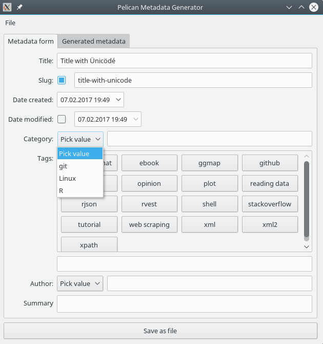

# Pelican Metadata Generator 

Graphical application that creates Pelican (<http://blog.getpelican.com/>)
post metadata. Written in Python 3.x and Qt 5.x (PyQt). Works on Linux,
Windows and Mac.

## Rationale

Pelican is static website generator that does not provide any way of
accessing existing content at new page creation. Simple typo in category 
name or tag name will create spurious entity that you might not catch in 
time and push to live site.

This application tries to prevent these mistakes from happening by 
exposing existing Pelican data in graphical user interface. Re-using
previous name is as easy as picking it up from GUI. Creation of new
categories or tags must be opted-in.

Added value is that slug will be generated automatically from post title
and will serve as post file name, if you decide to save data on disk.

## Dependencies

- Python 3.x <https://www.python.org/>
- PyQt5 <https://www.riverbankcomputing.com/software/pyqt/intro> | <https://pypi.python.org/pypi/PyQt5>
- slugify <https://pypi.python.org/pypi/PyQt5> | <https://pypi.python.org/pypi/python-slugify>

## Installation (Windows)

- Download and install Python 3 Miniconda from <https://conda.io/miniconda.html>
- Open command prompt (`cmd.exe`) and run following commands:
      conda create -n pmg python=3
      activate pmg
      pip install python-slugify PyQt5
- Download this repository

To run application:
- Open command prompt (`cmd.exe`)
- Run `activate pmg`
- Run `<path_to_repository>/pelican-metadata-generator.py -d <path_to_pelican_content_dir>`

## Adding to menu (Linux only)

Copy `pelican-metadata-generator.desktop` file into 
`$HOME/.local/share/applications/`. If you haven't put executable
somewhere in `$PATH`, modify `Exec=` line to include absolute path.
You probably also want to specify location of your Pelican content.

If you want your menu entry to have an icon, first you must obtain it.
There don't seem to be any "official" icon in Pelican sources. Personally,
I have used image from [@getpelican Twitter account](https://twitter.com/getpelican).
Then, modify `Icon=` line to provide absolute path to icon on your disk.

You might need to refresh menu database for your desktop environment
to pick up changes. KDE SC 4 users may use `kbuildsycoca4`.

## Copying

Distributed under GNU AGPLv3, the same as Pelican. See LICENSE file.
